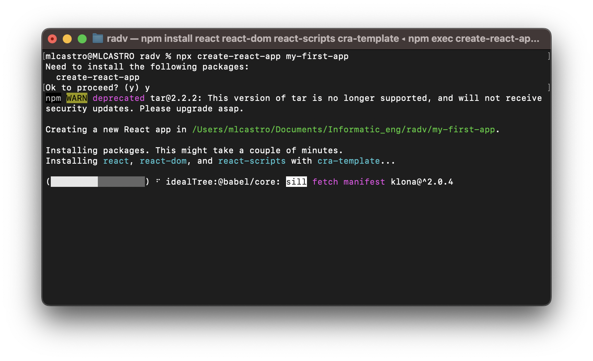
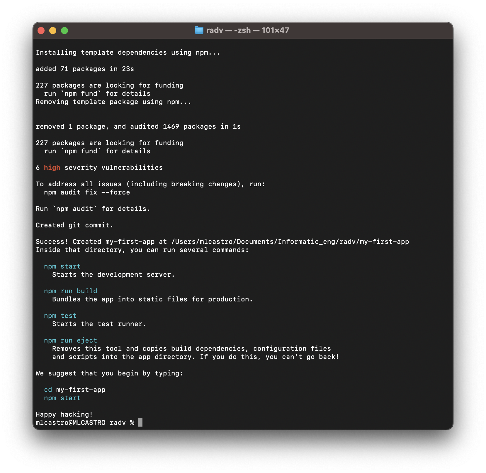
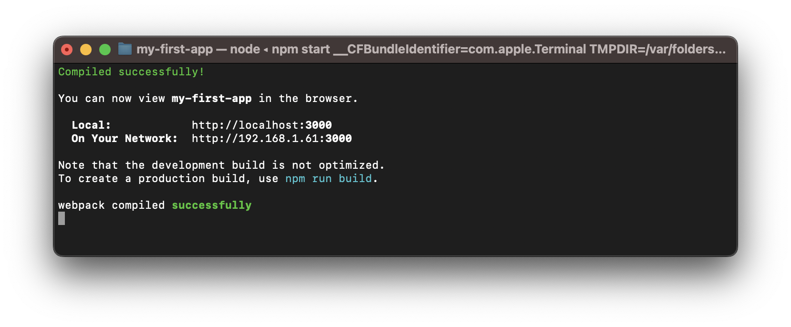
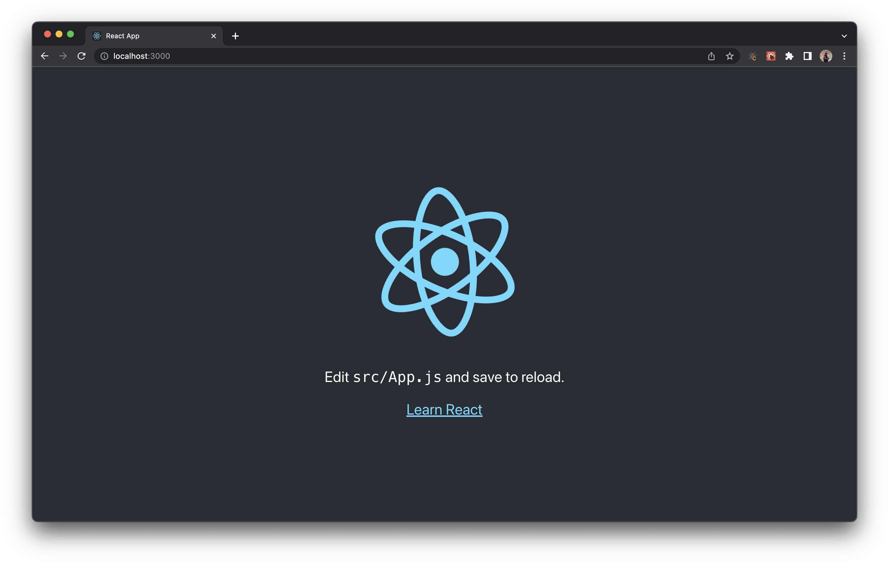

# Iniciar un proyecto con CRA (Create React App)

Se requiere de la instalación local de Node.js

Para crear un nuevo proyecto de react, abrimos el terminal y ejecutamos el comando

```
npx create-react-app my-first-app
```



Una vez finalizada la instalación, abrimos nuestra y ejecutamos nuestra aplicación.



```
cd my-first-app

npm start
```

Se abrira el puerto 3000 en nuestro local y visualizaremos la app de react.





De esta forma iniciamos un proyecto de react con CRA. 